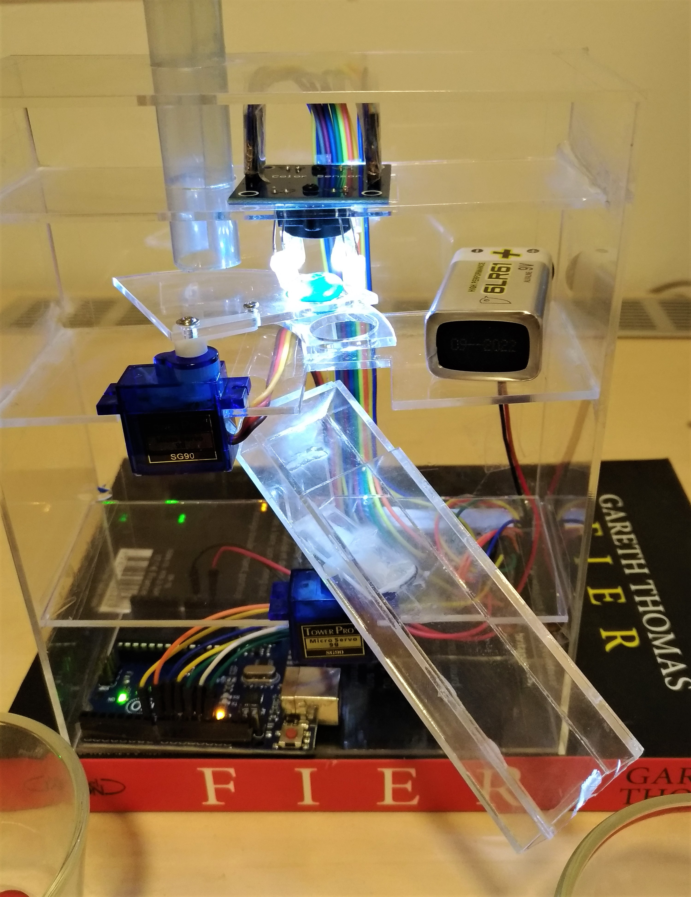
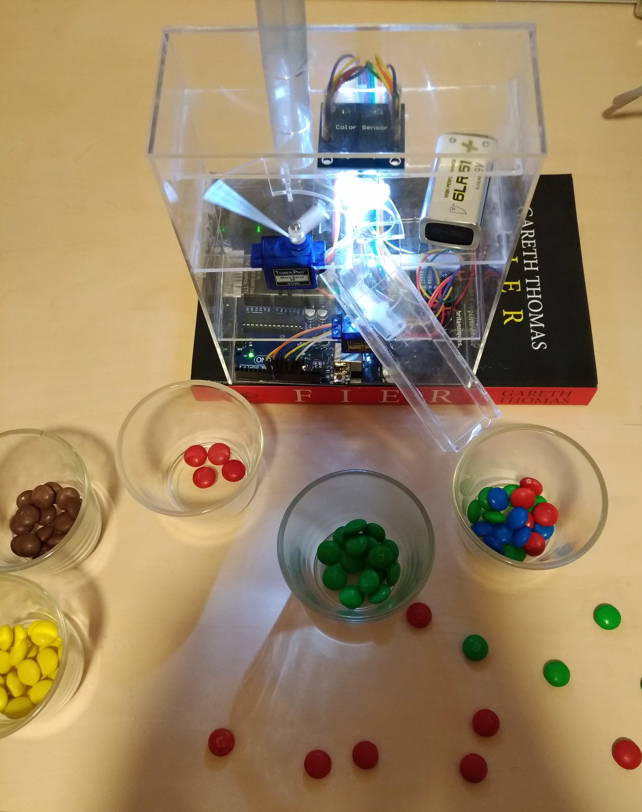
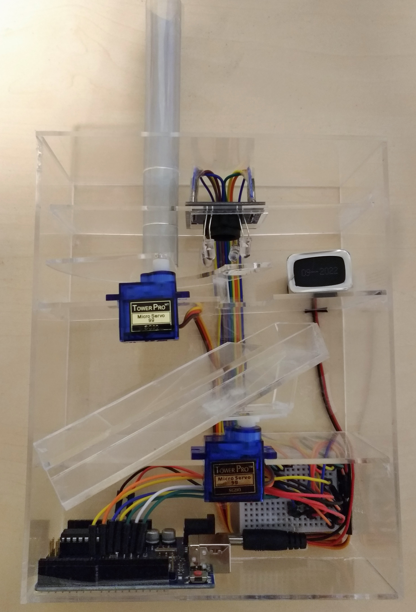

# M&M Sorter

:link: [The list of necessary items](https://docs.google.com/spreadsheets/d/1Q7FF3S4HWYS7HdumrN-qn6-QVmrpno_l1eS3zsmzjjE/edit), and [documentation](https://docs.google.com/document/d/1kxodLAJLGkm1ro1c2_9M5vvlxAfv8lFYGnMvJd8eEiU/edit?usp=sharing) is in romanian.

  
  
  

## Information :page_facing_up:
1. Initially, colored candies are held in a charger and fall in turn (they are taken over by a stepper-motor).
2. Then it is analyzed by the color sensor that detects its color.
3. Then the servomotor picks up the candy, rotates to the candy color container.
 ### More detailed :pencil:
 Sorting is done in 2 stages, namely: the first stage, which involves the sorting of yellow and brown colors, and the remaining candy will be put in all the recipes, then if they are 5 consecutive rows in the color sensor the absence of the bumble beans can pass at Stage 2, alerting the user by moving the redistribution bridge of the candy 5 times. 
	Step 2 involves sorting the other three colors: red, green and blue. :boom:

## Used components :gem:
* 1 x robotlinking uno r3
* 1 x breadboard
* 2 x servo-motor
* 1 x color-sensor
* jumper wire
* 1 x F-M cable
## Bugs :bug:
* It may happen that the candy remain stuck on the original collection tube.
* It can happen that candy remain stuck on the distribution bridge.
